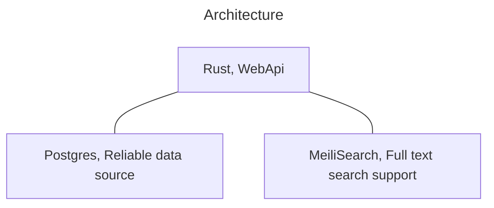
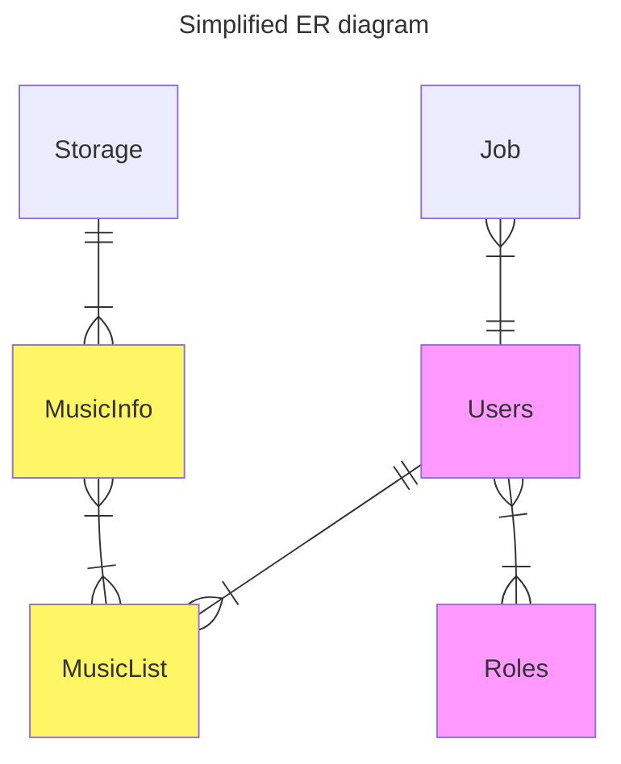
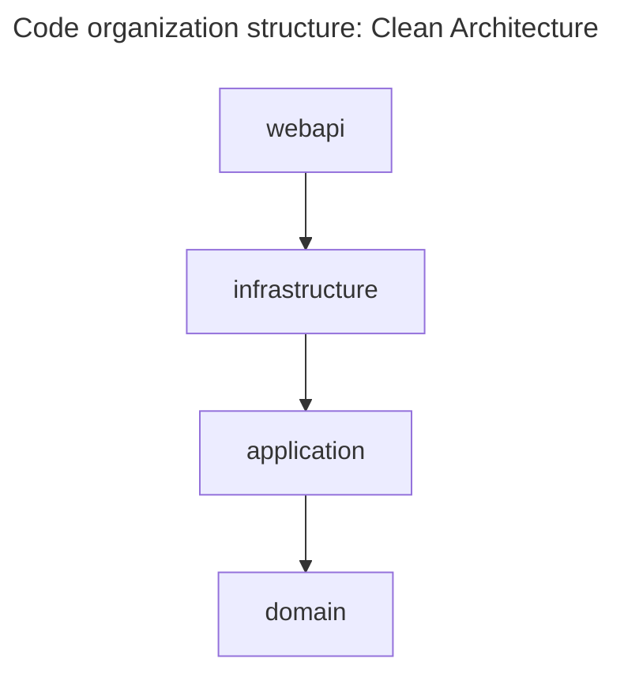

# TML

TML is a music library management system, using Domain-Driven Design.

## Usage

Dependencies:

- Database: Postgres 18
- Meilisearch

Before start tml, you need to create an empty database, and write the config.toml file(you can refer to config_example.toml).

Initialize an administrator account:

```shell
tml_webapi manage init-admin -u <username>
```

Then enter password.

Visit <listening_address> in browser, login, and you can manage normal users.

Create a _storage_, the `path` is the path of the machine where x is located.

Create a _job_, job_type is scan_incremental, fill the `storage_id` . Then, tml will scan the path of the storage, and record the metadata of music file (now only support mp3 and flac).

Now your music information are recorded.

## Documents

### Basic Design

Ubiquitous Language:

- Storage: A folder with many audio files.
- Job: Background task, including scan storage, manage Meilisearch index.
- MusicInfo: Metadata of audio file, including path, storage, title, etc.
- Admin: People who manage the system, they can create, update, read, delete the storage, music, job, normal user.
- Normal user: People who listening the music, they can have some music lists and they can get file stream from system.

AggregateRoots and entities:

- authentication
  - user
  - role
  - user_role
- management
  - job
  - storage
- application
  - music_info
  - music_info
  - music_info_music_info

### Architecture







### Technology details

- Rust 1.95.0 or later
- Database: PostgresSQL 18
- ORM: sea-orm

Clean Architecture, in one word: application layer and domain layer define and call `trait`, infrastructure layer implement `trait`, webapi layer inject the implemented `trait` into application layer, and define data entry and exit points.

#### Authentication

Use JWT. However, original JWTs cannot be revoked by the server. Therefore I add `security_stamp` in JWT and database(user entity), and check it when jwt verification. To avoid frequent database reads, I add memory cache and use _Cache-Aside Pattern_.

`security_stamp` will be changed when user data changed.

#### MusicInfo design

There are 2 conditions must be met:

- Database batch insert.
- After the audio location changed, just update the path. In other words, we should identify audio what ever where it is.

To satisfy the first condition, the `MusicInfo` should be one entity, with artist, album title.

To satisfy the second condition, the primary key of `MusicInfo` is some hash value. I choose 128 bit hash value, and use `Vec<u8>` as rust type and `bytea` as database column type. The hash algorithm use xxhash3-128, because there no security issue and it is a modren hash algorithm. The hash input is json of "title, artists, album, track_number, sample_rate, channels, bit_depth, bitrate"

However, the hash value is random, this is not friendly for B-Tree index. Therefore, I use `ALTER INDEX pkey SET (fillfactor = 80)` and `REINDEX INDEX CONCURRENTLY` after insert.
